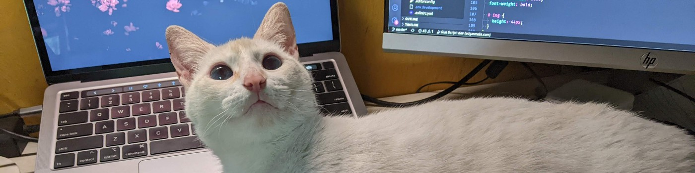

---

*You can see more information about my work experience in my [Linkedin](https://www.linkedin.com/in/mejia-edgar).*

## # Actuality - Hightech corp.
*Since JUN-2022.*

As mobile dev:
- iOS (UIKit).
- Android (Kotlin & Java).
- Both iOS & Android with Flutter.

## # 2022 - Creativa Consultores S.A.
*From JUN-2018 to JUN-2022.*

As Full-stack developer.

## # 2018 - BetterRide Inc.
*From MAR-2018 to MAY-2018.*

As Full-stack developer.
Part of tiny team, bringing some new features to API & web administrator as well.
- AngularJS.
- NodeJS.
- MongoDB.
- Java (Sprint Framework).

## # 2017 - Creativa Consultores S.A.
*As MEAN developer:*
- MongoDB.
- ExpressJS.
- Angular 2+.
- NodeJS.

