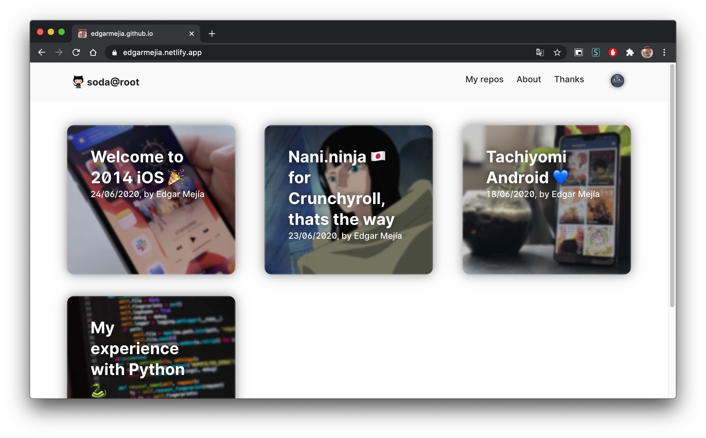

---

As I used open source resources for the creation of this site, feel free to use it as a base or as part of your own projects.

## Page based on:
- Repo: https://github.com/panr/gatsby-starter-hello-friend
- Demo: https://gatsby-hello-friend.now.sh/

Thanks [@panr](https://github.com/panr)

## Gatsby
- https://www.gatsbyjs.com/docs/reference/release-notes/image-migration-guide/
- https://www.gatsbyjs.com/docs/reference/release-notes/migrating-from-v2-to-v3/
- https://www.gatsbyjs.com/plugins/gatsby-awesome-pagination/
- https://github.com/csstools/postcss-plugins/tree/main/plugin-packs/postcss-preset-env

## Cards design
Part of my attempt to create blog-like entries on my personal page.
You can see what the result was in the following ss:

In the end I discarded the idea, like almost all the ones I've had in my life ...

- Idea taken from: https://designcode.io/
- https://github.com/MengTo/react-native-for-designers
- https://codepen.io/steveeeie/pen/NVWMEM
- https://codepen.io/abhishek747/pen/BbWKVa

## Footer
It seems simple, but leaving the footer fixed at the bottom of the page was the biggest challenge I encountered.

- https://dev.to/mokkapps/sticky-footer-in-gatsbyjs-using-flexbox-5162
