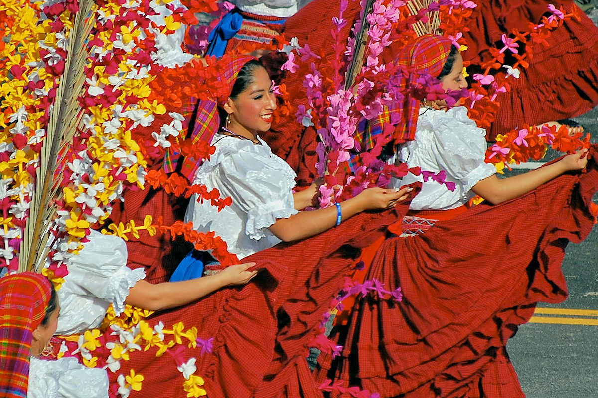

---

# Desarrollo de los dos temas

## La Cultura y sus fines en la vida de la persona
La cultura no es solo el conjunto de costumbres, arte, religión, lengua y tradiciones que identifican a un grupo humano, sino también un medio para que las personas se desarrollen de manera integral. Según Jacques Maritain, la cultura debe elevar la dignidad de la persona, fortalecer la ética y moral, facilitar la conexión con lo divino, servir al bien común y ser una expresión genuina de la individualidad.

La cultura ofrece a las personas un marco para interpretar el mundo, encontrar un propósito trascendental y fomentar el desarrollo tanto espiritual como material. Además, se convierte en un medio para preservar la identidad, promover la cohesión social y fomentar la creatividad individual y colectiva.

## Valores Culturales

Los valores culturales son principios éticos y morales que dan forma a la vida en sociedad. Estos incluyen valores como la familia, la educación, la comunidad, el trabajo, el respeto, la solidaridad y la tradición. Son fundamentales para la identidad de una comunidad, fomentando el sentido de pertenencia, la tolerancia, y la convivencia pacífica.

Los valores culturales pueden clasificarse en:
- Personales: honestidad, integridad, autodeterminación.
- Sociales: igualdad, justicia, solidaridad.
- Culturales: identidad, patrimonio, historia, tradición.

# Casos de la realidad salvadoreña en los cuales se apliquen los Valores culturales

## Las fiestas patronales

En comunidades como Suchitoto o Panchimalco, las fiestas patronales son una expresión clara de la identidad cultural, donde se celebran tradiciones religiosas, gastronomía típica, bailes folklóricos y desfiles.

## Programa “Un Pueblo, Un Producto”

Este programa promueve la identidad cultural local y el desarrollo económico basado en el rescate de productos artesanales y agrícolas tradicionales. Es un ejemplo del valor del trabajo y la tradición.

## Proyectos de Educación Rural

Iniciativas como las escuelas rurales apoyadas por ONG y el MINED enfatizan el valor de la educación como derecho y medio para mejorar la calidad de vida, especialmente en comunidades con acceso limitado.

## Solidaridad durante desastres naturales

Ante eventos como tormentas o terremotos, la población salvadoreña suele organizar colectas, albergues y voluntariados, reflejando valores culturales como la solidaridad, el respeto y el bien común.

# Importancia de la cultura y sus fines en la vida de la persona

La cultura enriquece a la persona, dándole herramientas para comprender su entorno, encontrar sentido a su vida y construir relaciones significativas. Fomenta el pensamiento crítico, la creatividad, el sentido de pertenencia y la búsqueda de la verdad. Además, permite a cada individuo desarrollarse como ser único y al mismo tiempo contribuir al bienestar colectivo.

# Importancia de los valores culturales para la vida de los ciudadanos en la sociedad

Los valores culturales garantizan la cohesión social y la paz. Al practicarlos, las personas desarrollan actitudes de respeto, tolerancia, empatía y cooperación, fundamentales para la vida en sociedad. También son esenciales para mantener viva la identidad de un pueblo, fortalecer la democracia y fomentar el respeto por la diversidad.

# Aprendizajes

- La cultura no es solo herencia, sino también creación.
- Los valores culturales fortalecen la identidad y la convivencia.
- El desarrollo personal y colectivo requiere una cultura basada en la dignidad, ética y sentido de comunidad.
- Los casos en El Salvador muestran que los valores culturales están vivos y en constante evolución.

# Conclusiones

La cultura y sus valores no solo definen a una sociedad, sino que la sostienen y la proyectan hacia el futuro. En El Salvador, los valores culturales han sido clave para la resistencia, la solidaridad y el desarrollo. Apostar por una cultura ética, inclusiva y dinámica es apostar por el bienestar de cada ciudadano y por una sociedad más justa y humana.