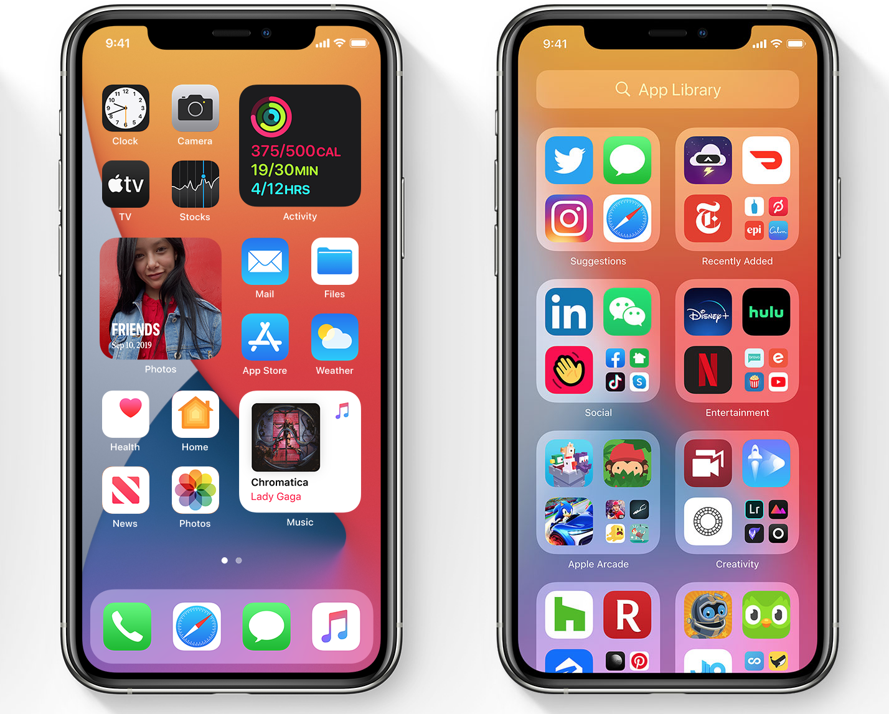

iOS ha dado un gran paso y ha descubierto como implementar los widgets de forma correcta en su interfaz, que increiblemente sigue siendo demasiado parecida a la primera versión de iOS, lo que no es malo ya que al ser un diseño que funciona tan bien no ha sido necesario para Apple hacer cambios mayores a la misma.

## Un Android más adulto
Quizá inicialmente Apple tenia razón al pasar por completo del sistema de Google, pero el tiempo ha pasado e ignorar tanto a tu principal competidor le ha pasado factura a la manzana mordida.
Android ya no es la versión barata a iOS, ahora es y por mucho, bastante más superior en muchos aspectos a iOS.
