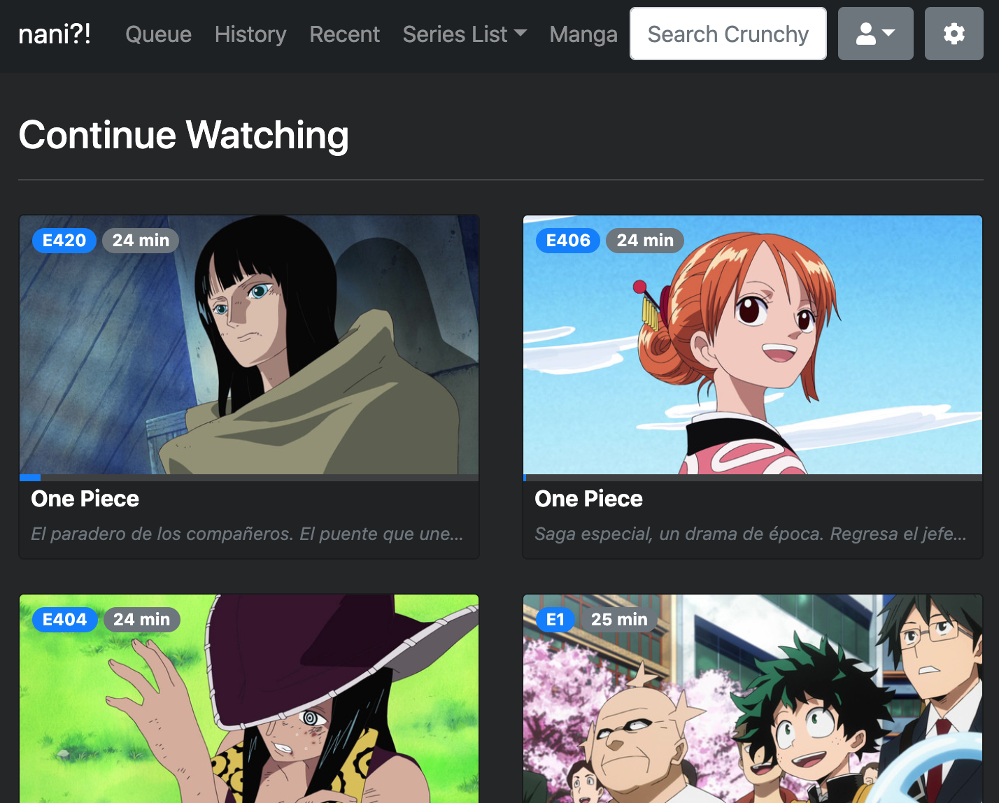

Desde hace poco más de un año he visto como Python es cada vez más popular, por lo que me he sentido cada
vez mas interesado en aprender este lenguaje.

### Conocimiento previo del lenguaje
De este lenguaje sólo sabia que es bastante "simple", ya que no es necesario el `;` tampoco `{}` por lo que
tenemos que valernos por completo del uso correcto de identación. Ser ordenado en este lenguaje es algo que se agradece.
