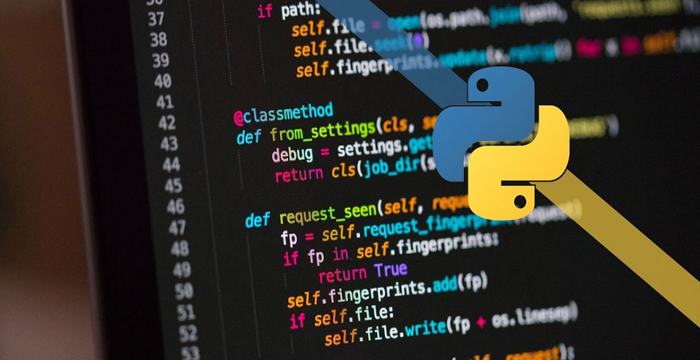

<!--  -->

Desde hace poco más de un año he visto como Python es cada vez más popular, por lo que me he sentido cada
vez mas interesado en aprender este lenguaje.

### Conocimiento previo del lenguaje
De este lenguaje sólo sabia que es bastante "simple", ya que no es necesario el `;` tampoco `{}` por lo que
tenemos que valernos por completo del uso correcto de identación. Ser ordenado en este lenguaje es algo que se agradece.

### Primeras impresiones

```python
    if is_weekend:
        print("Is weekend! 🍺")
    else:
        print("Wait for weekend 🥺")
```

La forma de crear funciones tambien es bastante simple, basta con usar la palabra reserbada `def`, al no usar llaves para delimitar cuando inicia y termina la función, se hace uso de `:` para marcar el inicio del contenido de la función

```python
    def is_friday(day_number=0):
        return day_number is 5
```
